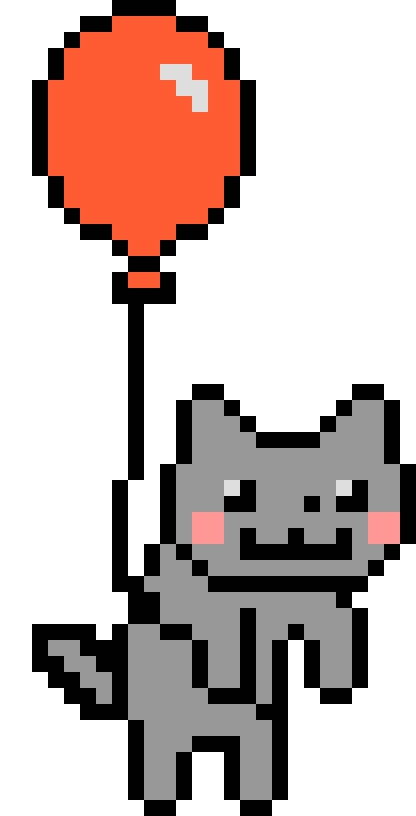

<div align="center">

<!-- Pink waving banner on top -->


<!-- ogiua.gif full width - chạy xuyên màn hình -->


<br/>

<!-- Dòng chào -->
<h3>🌸 Xin chào! Chào mừng bạn ghé thăm trang của mình 🌸</h3>

<br/>

<h1>Hi! I'm Huệ Trinh 🌸</h1>
<h3>Designer ✦ Tester ✦ Developer 💖</h3>

<br/>


</div>

<br/>

---

## 🌷 Về Mình

<table>
<tr>
<td width="25%" align="center" valign="middle">

<!-- bentrai.webp bên trái -->


</td>
<td width="50%" valign="top">

Xin chào! Mình là **Huệ Trinh** — một người yêu thích sự tỉ mỉ, sáng tạo và luôn hướng đến trải nghiệm người dùng tốt nhất.

Mình có nền tảng vững về **thiết kế UI/UX** và **kiểm thử phần mềm**, kết hợp tư duy phân tích với con mắt thẩm mỹ để xây dựng sản phẩm chất lượng từ giao diện đến chức năng.

- 🎯 Tập trung vào chất lượng sản phẩm & trải nghiệm người dùng
- 🌱 Không ngừng học hỏi và cải thiện mỗi ngày
- � Thích làm việc nhóm và chia sẻ kiến thức
- 💡 Luôn tìm giải pháp sáng tạo cho vấn đề phức tạp

</td>
<td width="25%" align="center" valign="middle">

<!-- gif mèo gõ máy tính ở giữa/phải -->


</td>
</tr>
</table>

<div align="center">

```
╔══════════════════════════════╗
║   🌸  Huệ Trinh  🌸          ║
╠══════════════════════════════╣
║  🎨  UI/UX Designer          ║
║  🧪  QA Tester               ║
║  💻  Web Developer           ║
║  📍  Viet Nam                ║
║  💌  Open to collaborate     ║
╚══════════════════════════════╝
```

</div>

---

## 🎨 Kỹ Năng

### 🖌️ Thiết Kế (Design)

<div>


</div>

<br/>

### 🧪 Kiểm Thử (Testing)

<div>


</div>

<br/>

### � Lập Trình (Development)

<div>


</div>

---

## 🚀 Dự Án Tiêu Biểu

<table>
<tr>
<td width="50%" valign="top">

### 📚 Website Bán Sách
> Nền tảng thương mại điện tử chuyên về sách

- 🛒 Tìm kiếm, lọc và mua sách trực tuyến
- 👤 Quản lý tài khoản & lịch sử đơn hàng
- 🎨 Giao diện thân thiện, dễ sử dụng
- 🔧 Stack: HTML, CSS, JavaScript

[](https://github.com/huetrinh204/bookstore)

</td>
<td width="50%" valign="top">

### 🗜️ Hệ Thống Nén Ảnh
> Công cụ tối ưu hóa và nén ảnh thông minh

- 📉 Giảm dung lượng ảnh hiệu quả
- 🖼️ Hỗ trợ nhiều định dạng ảnh phổ biến
- ⚡ Xử lý nhanh, giữ chất lượng tốt
- 🔧 Stack: Python, Image Processing

[](https://github.com/huetrinh204/HeThongNenAnh)

</td>
</tr>
<tr>
<td width="50%" valign="top">

### 🥗 Website Lối Sống Lành Mạnh
> Nền tảng hỗ trợ duy trì thói quen sống khỏe

- 🏃 Theo dõi hoạt động thể chất hàng ngày
- 🥦 Gợi ý chế độ dinh dưỡng cân bằng
- 📊 Dashboard thống kê tiến trình cá nhân
- 🔧 Stack: HTML, CSS, JavaScript

[](https://github.com/huetrinh204/cn-da22ttc-thachthihuetrinh-ungdungwebhotroduytriloisonglanhmanh)

</td>
<td width="50%" valign="top">

### 🎮 Game DrawGuess
> Game vẽ hình và đoán từ theo thời gian thực

- ✏️ Vẽ tự do trên canvas tương tác
- � Chơi nhiều người cùng lúc (multiplayer)
- ⏱️ Hệ thống tính điểm & đếm ngược
- 🔧 Stack: JavaScript, WebSocket

[](https://github.com/huetrinh204/DrawGuess)

</td>
</tr>
</table>

---

## 📊 GitHub Stats

<div align="center">


<br/><br/>


</div>

---

## 🌸 Liên Hệ

<div align="center">

<a href="mailto:trinhfokko@gmail.com">
  
</a>
&nbsp;
<a href="https://www.facebook.com/trinh.hue.08/">
  
</a>

</div>

---

<div align="center">


<br/>

<p>🌸 Thanks for visiting! Have a lovely day! ✨💖</p>

<br/>


🌸 ✨ 💫 🎀 🌷 💖 🌼 ⭐ 🌸 ✨ 💫 🎀 🌷 💖 🌼 ⭐

</div>
